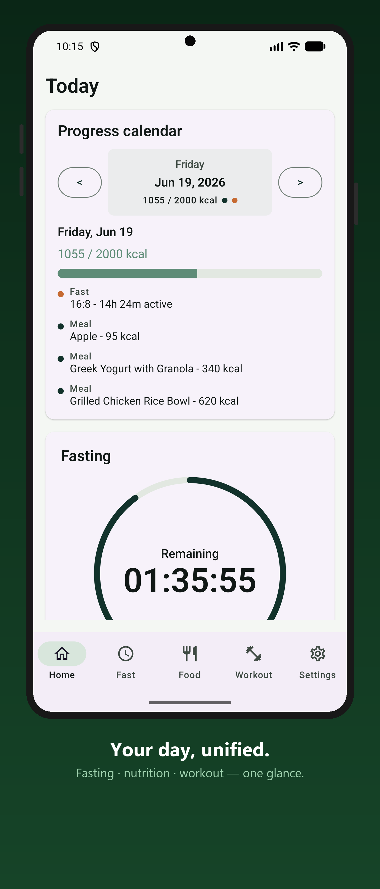
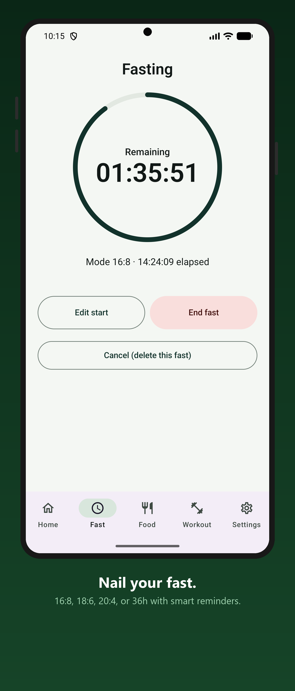
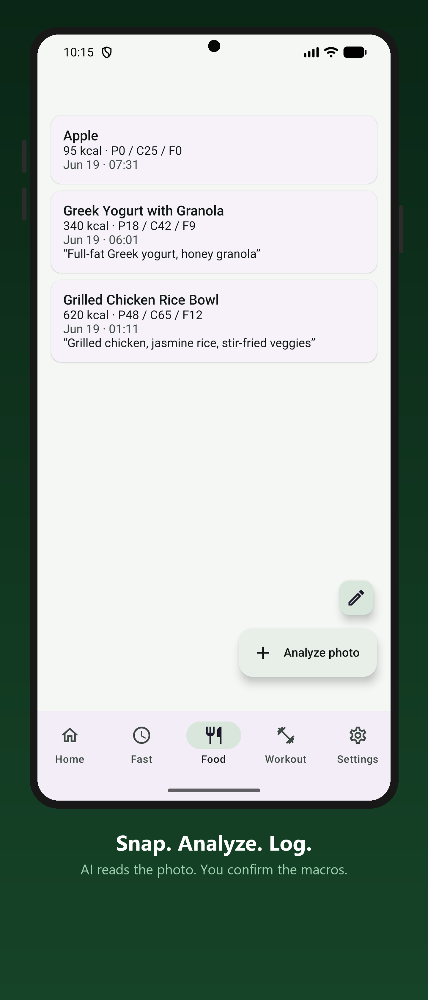
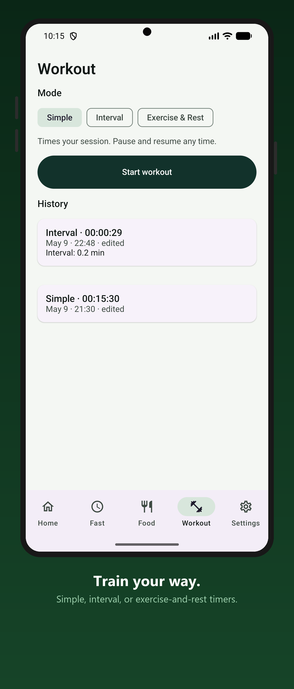
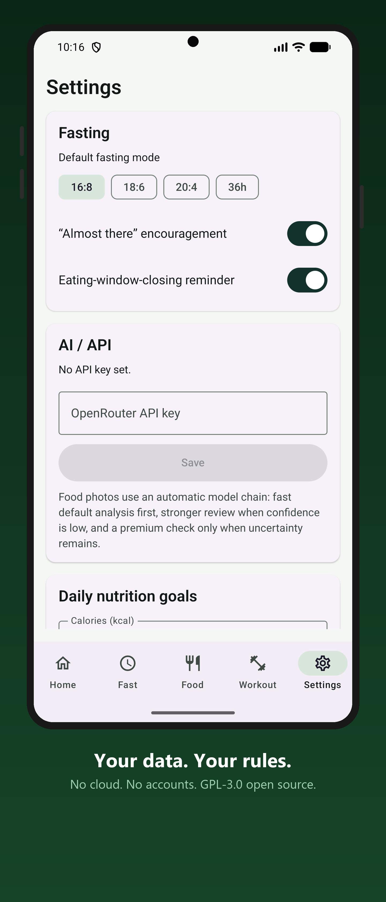

<p align="center">
  
</p>

<h1 align="center">Solo Forge</h1>

<p align="center">Local-first intermittent fasting, calorie, weight &amp; workout tracker</p>

<p align="center">
  <a href="https://f-droid.org/packages/com.kbul.spicycrab/"></a>
  <a href="https://play.google.com/store/apps/details?id=com.kbul.spicycrab"></a>
</p>

Solo Forge is a free and open source, local-first Android fitness app for fasting, nutrition, weight tracking, and workout timing. It is GPL-3.0 licensed and built to keep user data on the device, with no backend, account system, analytics, or cloud telemetry.

The only intentional outbound network request is a user-initiated OpenRouter call for food analysis (photo or text description), using an API key supplied by the user. AI features can be switched off entirely in Settings.

**Website:** [soloforge.dimitroff.work](https://soloforge.dimitroff.work) — landing page and privacy policy. Maintained in the separate [soloforge-site](https://github.com/kirilan/soloforge-site) repo (Cloudflare Pages, deploys on push); update it when a release changes features, screenshots, or the store description.

## Screenshots

<p align="center">
  
  
  
  
  
</p>

## Current Features

- Intermittent fasting timer with 16:8, 18:6, 20:4, and 36 hour modes.
- Smart fasting reminders driven by timer state instead of fixed daily spam.
- AI-assisted food analysis (photo or text description) through OpenRouter — one request per analysis, a choice of four measured models (or your own), and an off switch in Settings.
- Manual meal entry and one-tap meal presets when the user does not want to use AI.
- Editable food entries, including proportional macro recalculation by total grams.
- Local nutrition tracking with calorie and macro goals.
- Versioned JSON backup: export, import (merge or replace), and an optional auto-backup folder that rewrites the backup file on every data change.
- Weight tracking with edit/delete support, history, charting, and a weekly weigh-in reminder.
- Workout timers:
  - simple session timer with pause/resume
  - interval timer with periodic audio cues
  - exercise/rest toggle timer
- Home dashboard with daily fasting, nutrition, workout, weight, and calendar progress, plus a per-day journal note.
- Optional Health Connect sync for weight and exercise (import and export toggled separately, both off by default).
- Configurable bottom tabs.
- Localized in English, German, Spanish, French, Brazilian Portuguese, Russian, and Turkish.
- Local Room migrations with exported schemas and migration tests.

## Privacy Model

Solo Forge is designed around local ownership of fitness data.

- No backend.
- No authentication.
- No analytics SDKs.
- No crash reporting SDKs.
- No Firebase.
- No broad media, contacts, or logs permissions.
- Android system cloud backup is disabled (`allowBackup=false`); device migration uses the explicit export/import flow.
- The OpenRouter API key is stored in encrypted local preferences and is never included in backups.
- Backup is explicit: a versioned JSON file exported on demand, or auto-written to a user-selected folder (which the user can sync to Drive/Dropbox themselves).

The app declares `INTERNET` only for food analysis through OpenRouter. That call happens only when the user starts an analysis; with AI features off, the app makes zero network calls.

Health Connect is opt-in and off by default. It is an on-device integration: weight and exercise records are read from and written to the local Health Connect store, never uploaded anywhere by Solo Forge.

Every food analysis is a single request to whichever model the user selected (default `google/gemini-3.1-flash-lite`). There is no automatic escalation: a second, stronger model is reached only when the user explicitly taps "Retry with a stronger model", and that button is hidden entirely for rows that have nothing stronger above them. Uncertain results are surfaced to the user by `AnalysisPolicy` instead of being silently re-sent to a bigger model. See [Food Analysis Models](#food-analysis-models) for the options and how they were chosen.

## Food Analysis Models

Settings offers four tested configurations plus an escape hatch. Every figure below is measured by this repo's own eval (`tools/food_eval/`) against the app's exact prompt, image preprocessing and request shape — never quoted from a vendor benchmark.

| Setting | Model | Calorie error | Answers without asking | Typical / worst wait | Cost per 1000 |
|---|---|---|---|---|---|
| **Fastest** (default) | `google/gemini-3.1-flash-lite` | 22.6% | 17/44 | **2.0s** / 3.9s | $0.84 |
| **Balanced** | `google/gemini-3.7-flash` | 21.9% | **24/44** | 8.1s / 14.8s | $3.79 |
| **Open-weight** | `qwen/qwen3-vl-32b-instruct` (Apache-2.0) | 25.9% | 14/44 | 7.5s / 16.2s | **$0.24** |
| **Most accurate** | `google/gemini-3.1-pro-preview` | **17.3%** | 17/44 | 4.8s / 16.8s | $9.37 |
| *Advanced* | any OpenRouter model id | not tested | — | unknown | — |

44 cases, one run each, 2026-08-29. Cost assumes the user's own OpenRouter key and their own rates.

### Why the settings look like this

**Four named options, not a model picker.** An accuracy label is only honest if it comes from our own measurements, and the app never prints a number it did not measure — so the list is bounded by what has actually been evaluated. The *Advanced* field still accepts any model id, but it shows a warning where the other rows show figures.

**Curation is also a safety filter, not just a labelling one.** Screening rejected models that would have looked good in a table. One fast, permissively licensed candidate confidently identified an unreadable dessert photo as "fruit salad with cottage cheese" with no uncertainty flags at all; another returned top-level JSON arrays on 8 of 44 cases, which the app cannot parse.

**The retry model belongs to the row, not to the app.** "Retry with a stronger model" escalates to `gemini-3.1-pro-preview`, which measurably helps — it nearly halves the error on multi-component plates. But it is not stronger than itself, and no Apache-2.0 model we measured beats the open-weight row, so **both of those rows hide the retry button** rather than offer a sideways move or quietly swap a user out of the licence they chose.

**Labels lead with waiting time and how often you get asked a follow-up question**, with calorie error second. Two findings drove that ordering: the accuracy figure is noisier than it looks, and **69% of the models that completed a clean screen would not accept a single one of five test photos outright** — under this app's uncertainty policy, a "more accurate" model can easily mean an app that asks a question about every meal. That is the difference a user actually feels.

**Stored settings use stable tokens** (`fast`, `balanced`, `open`, `accurate`, `custom`), never model ids, so replacing a model in a future release does not invalidate saved preferences or older backups.

### How the models were chosen

`tools/food_eval/` replays the app's real request against a local case set: 27 dish photos from [Nutrition5k](https://github.com/google-research-datasets/Nutrition5k) (CC BY 4.0, scale-measured ground truth), 14 text descriptions, and a few of the maintainer's own phone photos. It scores calorie error, schema validity, latency, and whether routing lands where the case says it should. Ground truth comes from labels, a nutrient database, or a kitchen scale — never from another model.

In August 2026 every vision-capable model OpenRouter had carried in the previous twelve months was screened this way: **169 candidates, 108 after removing batch variants, aliases, image generators and code specialists, then 540 calls across a fixed set of five photos.** Fifty-two passed the screen; 35 were rejected on latency alone, several taking 27–55 seconds to answer a food photo against a 60-second client timeout. Survivors got a full 44-case run.

Findings worth recording, beyond which model won:

- **The response contract is durable.** 99.1% of 459 calls across 107 models from ~20 vendors returned schema-valid JSON, none of which had ever seen this prompt. Changing model carries almost no parsing risk.
- **Portion size is the real problem, not model quality.** `portion_unknown` appears in 80% of all analyses. On one test photo — a plate of almonds that 77 of 88 models identified correctly — the calorie-per-gram maths was essentially exact and the entire error was estimating 30g of nuts instead of 39g. No stronger model fixes that; asking the user does.
- **A bug worth more than any model swap.** The app had never actually sent its `temperature` setting, because a serialization default silently dropped the field. Fixing it improved calorie error by 6.5 percentage points — more than the gap between any two models in the table above.
- **Bigger is not automatically an escalation.** The obvious larger sibling of the open-weight row measured as a sidegrade: no accuracy gain, worse on multi-component plates, and one call that took 142 seconds.

Full method, per-bucket results, rejected candidates and the reasoning behind each decision are in [`docs/food-analysis-model-improvement-plan.md`](docs/food-analysis-model-improvement-plan.md) and [`docs/curated-model-choice-plan.md`](docs/curated-model-choice-plan.md). Before any change to a model id, prompt, temperature, image preprocessing or schema, every offered row and every escalation target is re-run.

## Tech Stack

- Kotlin
- Jetpack Compose
- Material 3
- Single-activity architecture
- Hilt dependency injection
- Room SQLite storage
- DataStore preferences
- EncryptedSharedPreferences for the OpenRouter API key
- WorkManager for scheduled reminders
- Foreground services for active timers
- CameraX for food capture
- Ktor and kotlinx.serialization for OpenRouter
- Coil for image loading
- Hand-rolled Compose charts (no chart library)

## Requirements

- Android Studio with Android SDK installed
- JDK 17
- Android emulator or physical Android device
- Min SDK 26
- Compile SDK 36
- Target SDK 36

## Build

Clone the repo and open it in Android Studio, or build from the command line:

```powershell
.\gradlew.bat assembleDebug
```

The debug APK is generated at:

```text
app/build/outputs/apk/debug/app-debug.apk
```

Install on a connected emulator or device:

```powershell
adb install -r app/build/outputs/apk/debug/app-debug.apk
```

## Tests

Run the unit tests (backup format, calendar math, streaks, analysis policy, workout state recovery, OpenRouter parsing):

```powershell
.\gradlew.bat testDebugUnitTest
```

Run the connected Room migration tests with an emulator or device attached:

```powershell
.\gradlew.bat :app:connectedDebugAndroidTest
```

Run lint (`MissingTranslation` is an error — every new string ships in all seven locales):

```powershell
.\gradlew.bat lintDebug
```

Before changing a model id, prompt, temperature, image preprocessing, or the response schema, replay the request against the local case set with `tools/food_eval/` (see its README).

## F-Droid

Solo Forge is published on F-Droid as [`com.kbul.spicycrab`](https://f-droid.org/packages/com.kbul.spicycrab/). Listing content comes from:

```text
.fdroid.yml
fastlane/metadata/android/en-US/
```

The fdroiddata recipe uses `UpdateCheckMode: Tags` with `AutoUpdateMode: Version`, so pushing a `vX.Y.Z` release tag is what triggers an F-Droid release (published in roughly 2–7 days). The official recipe deliberately has no `AntiFeatures:` — the F-Droid reviewer removed the `NonFreeNet` flag during inclusion review (fdroiddata MR !38080) because the OpenRouter feature is off by default, opt-in, and requires the user's own key. Do not re-add it.

## Google Play

Solo Forge is also live on Google Play as [`com.kbul.spicycrab`](https://play.google.com/store/apps/details?id=com.kbul.spicycrab). The Play build is a release AAB signed with the upload key (`.\gradlew.bat bundleRelease`), so it is a separate signing identity from the F-Droid and GitHub builds and the three are not cross-installable. The store listing text and screenshots come from the same `fastlane/metadata/android/en-US/` content.

## Project Layout

```text
app/src/main/java/com/kbul/spicycrab/
├── MainActivity.kt
├── SpicyCrabApp.kt
├── data/
│   ├── backup/
│   ├── db/
│   └── prefs/
├── di/
├── domain/
│   ├── fasting/
│   ├── health/
│   ├── nutrition/
│   ├── weight/
│   └── workout/
├── network/
├── notifications/
└── ui/
    ├── common/
    ├── fasting/
    ├── food/
    ├── home/
    ├── nav/
    ├── onboarding/
    ├── settings/
    ├── theme/
    ├── weight/
    └── workout/
```

The package name still uses the original `com.kbul.spicycrab` namespace. The app-facing brand is Solo Forge.

## Room Migrations

Room migrations are mandatory. Do not use destructive migration fallbacks.

For schema changes:

1. Edit the entity.
2. Bump the Room database version.
3. Add a migration in `Migrations.kt`.
4. Append it to `ALL_MIGRATIONS`.
5. Build once to export the new schema under `app/schemas/`.
6. Add or update an androidTest migration test.

## Branding

Brand notes and early SVG assets live in:

```text
BRAND-BRIEF.md
brand/
```

## License

Solo Forge is licensed under the GNU General Public License v3.0. See [LICENSE](LICENSE) for the full license text.

## Status

Solo Forge is released and published on F-Droid and Google Play, with debug-signed APKs on GitHub releases. Core features — fasting, food tracking, weight, workouts, dashboard, and JSON backup export/import — are in place; development continues on UI polish and broader device testing.
